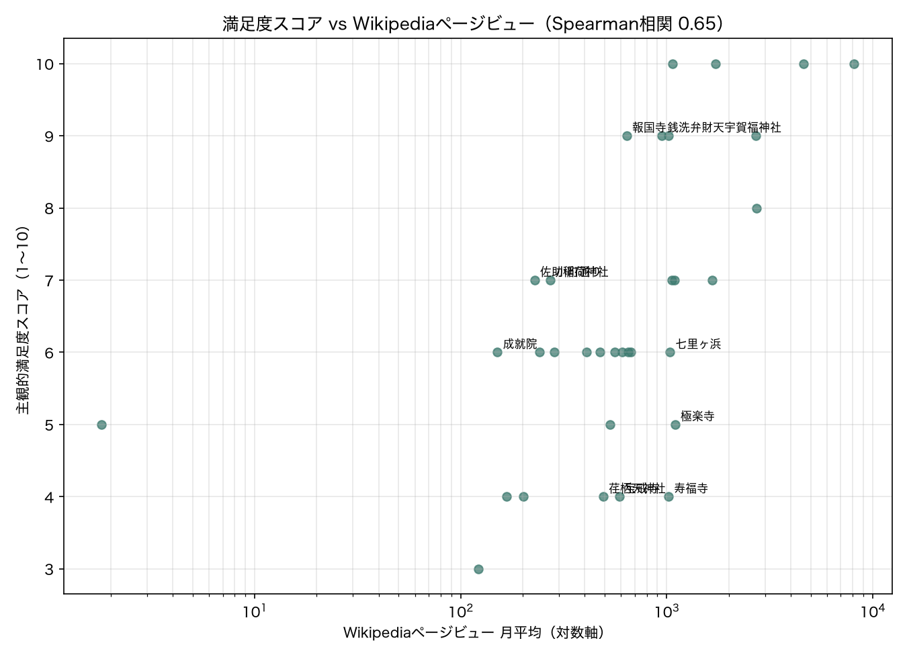

# 鎌倉 周遊ルート最適化アプリ

- フロントエンド: https://kanagawa-route.vercel.app/
- バックエンドAPI: https://kanagawa-route-api.onrender.com

持ち時間と好みを入力すると、拝観時間の制約を守りつつ満足度が最大になる
鎌倉観光の順路を提案する Web アプリ。

もともと Streamlit の単一アプリだったが、FastAPI（バックエンド）と
Next.js（フロントエンド）に分離した構成に移行した。最適化ロジック本体
（`optimize.py` / `travel_time.py`）は移行の前後で変更していない。

## 課題設定

観光は「全部は回れない」。限られた時間の中で**どこを選び、どの順で回るか**を
同時に決める必要がある。これは巡回セールスマン問題（全地点を回る最短経路）ではなく、
**オリエンテーリング問題**（制限時間内で獲得価値を最大化する経路選択）にあたる。

- 決定変数: 各スポットを訪問するか / 訪問順
- 制約: 総所要時間 ≤ 持ち時間、各スポットの拝観時間内に到着
- 目的関数: 訪問スポットの満足度スコア合計を最大化

## 技術構成

| 領域 | 使用技術 |
|---|---|
| 最適化 | OR-Tools Routing (GUIDED_LOCAL_SEARCH) |
| バックエンドAPI | FastAPI |
| フロントエンド | Next.js (App Router), react-leaflet |
| データ取得 | Overpass API, Nominatim, OpenRouteService |
| 環境管理 | uv (Python), npm (Next.js) |
| デプロイ | Render (API) / Vercel (フロントエンド) |

画像選定用の内部ツール（`select_photos.py`）のみ、移行後もStreamlitを使い続けている。

## データ整備

### OSM だけでは足りなかった

Overpass API で鎌倉エリアを取得したところ **723件**。しかし内訳を精査すると:

- `historic=memorial`（句碑・供養塔）が230件、`wayside_shrine` が40件
  → 観光の目的地にならないものが全体の37%
- `opening_hours` の充足率は 9%（67/723）
- **高徳院・長谷寺・報国寺・建長寺・円覚寺など主要スポットが欠落**

タグの調整では主要スポットの欠落を解決できないと判断し、
**主要34件を手動で選定してマスタ化**する方針に切り替えた。
座標は Nominatim で自動取得（34件中32件が成功、2件は手動補完）。

滞在時間・拝観時間・拝観料・満足度スコアは手入力。
スコアは 1〜10 で、知名度と体験の質を基準に自分で設定した。

### 移動時間モデル

当初は直線距離 × 迂回係数1.4 ÷ 徒歩4km/h で近似した。
しかし検算で **鎌倉高校前駅 → 瑞泉寺が149.8分** と算出され、実態と乖離していた。
実際は江ノ電を使えば大幅に短縮できる。

そこで各スポットに最寄駅を割り当て、以下の短い方を採用するモデルに変更:

- 徒歩のみ
- 出発地→最寄駅（徒歩）+ 待ち時間 + 駅間乗車 + 到着駅→目的地（徒歩）

結果、同区間は **73.6分** となり、平均移動時間も 48.0分 → 33.3分 に改善した。

### 直線距離近似の検証（ORS実測との比較）

上記の徒歩時間はまだ直線距離からの近似だったため、OpenRouteService (ORS) で
全スポット間の徒歩所要時間を実測し、`compare_matrix.py` で近似値と突き合わせた
（561区間、`matrix_comparison.csv`）。

- 相関係数: **0.977**（傾向としては近似も悪くない）
- 平均誤差: **+10.5分**（近似は実測より系統的に過大）
- 現行の迂回係数1.4に対し、実測に最も適合する係数は **1.09**

迂回係数を調整するのではなく、**スポット間の徒歩時間はORS実測値をそのまま
採用**する方針にした（`travel_time.py` の `build_matrix`）。直線距離近似は、
実測行列に含まれない区間（起点⇔スポット、最寄駅までの徒歩など）を補う
フォールバックとしてのみ残している。

### スコアの妥当性検証（Wikipediaページビューとの比較）

満足度スコアは知名度と体験の質を基準に自分で設定した主観的な値なので、
客観指標と突き合わせてどの程度妥当か検証した。日本語版Wikipediaの各スポット
記事のページビュー（直近12か月の月平均、`fetch_pageviews.py`）を知名度の
代理指標とし、順位相関（Spearman）を`compare_score_pageviews.py`で計算した。

スポット名をそのままWikipedia記事タイトルにすると、34件中9件で誤ったデータ
になることが分かった。報国寺・浄妙寺・瑞泉寺・御霊神社・成就院・極楽寺・
光明寺は全国の同名寺社の**曖昧さ回避ページ**に、長谷寺は**奈良県桜井市**の
長谷寺に一致してしまう。鎌倉のものを指す「〇〇 (鎌倉市)」という記事名に
差し替えて対応した。高徳院は通称「鎌倉大仏」でも別途ページビューが計上
されるため両方の合計を採用し、半僧坊（建長寺境内の一施設で独立記事なし）
は欠損として除外した。

**結果**: 33件（半僧坊を除く）でSpearman順位相関 **0.65**（p<0.001）。
主観スコアと客観的な知名度の間に中程度以上の相関があり、大きく的外れな
評価にはなっていなさそうだった。



乖離が大きかったスポット（パーセンタイル順位の差、上位5件ずつ）:

| スコアの割に客観的関心が低い | 客観的関心の割にスコアが低い |
|---|---|
| 佐助稲荷神社・小町通り・成就院・報国寺・銭洗弁財天宇賀福神社 | 極楽寺・寿福寺・宝戒寺・七里ヶ浜・荏柄天神社 |

n=33と少数のため、相関係数の値自体を過信せず「大まかな傾向の裏付け」
程度に捉えている。乖離の原因（例えば知名度以外の体験価値を重視したのか、
単に採点のブレか）までは今回切り分けておらず、今後の課題とする。

## 最適化で直面した問題

### 1. 目的関数の設計ミス

初期実装では「訪問数の最大化」を目的関数にした。


**鶴岡八幡宮も大仏も長谷寺も入らない。**
滞在時間が短く近接したスポットを詰め込むのが最適、とモデルが判断したため。

数学的には正しい解だが、目的が間違っていた。
スポットごとの満足度スコアを導入し、その合計の最大化に変更。

### 2. CP-SAT では解けきれなかった

当初 CP-SAT で BIG-M による時刻制約を組んだが、34地点では探索が終わらなかった。

| | 状態 | 目的関数値 | 上界 |
|---|---|---|---|
| CP-SAT (60秒) | FEASIBLE | 69.0 | 239.0 |

BIG-M 制約は線形緩和が弱く枝刈りが効きにくい。
経路問題専用の OR-Tools Routing に移行し、時間枠制約と
訪問省略（AddDisjunction）を標準機能で表現した。

### 3. パラメータではなく制約構造が原因だった

Routing 移行後、省略ペナルティ係数を 100 / 300 / 1000 の3水準で振ったが、
**3つとも完全に同一の解**が返った。

パラメータが効いていないと判断し、制約構造を疑った。
`AddDimension` の待機許容量を 0 にしていたため、
「開門前に到着したら待つ」ができず探索空間が過度に狭まっていた。

待機を60分まで許可したところ:

| 設定 | 訪問数 | 満足度合計 |
|---|---|---|
| 待機0分 | 9件 | 54 |
| 待機60分 | 8件 | **67** |

訪問数は減ったが満足度は向上。「数は少なくても価値の高いスポットを回る」
という意図した挙動になり、ルートも実際の観光動線に沿ったものになった。

## デプロイで直面した問題

### .gitignore が frontend/lib を除外していた

ルートの `.gitignore` はPythonパッケージング成果物向けに `lib/` / `lib64/` を
含んでいたが、先頭に `/` が無かったため、意図せず `frontend/lib/` にも
マッチしていた。結果として `frontend/lib` 配下（`api.ts` / `types.ts` /
`areaStyles.ts` / `markerOffset.ts`）が最初のコミットから一度も追跡されて
おらず、Vercelのビルドが `Module not found` で失敗した。`components` は
たまたまどの除外パターンにも一致しなかったため、そちらは気づかれずに
デプロイできてしまっていた。`/lib/` `/lib64/` とリポジトリ直下限定に
修正して解決。

### 本番とローカルで探索結果にスコア差が出る

同一条件（出発9:00・持ち時間6時間・計算時間5秒・待機60分）で比較したところ、
ローカルは5回中5回とも合計スコア59、Render無料枠は5回中5回とも57と、
それぞれの環境内では安定しているが環境間で差が出た。計算時間を30秒に
延ばすと 59→60（ローカル）、57→59（Render）といずれも改善し、差は1点に
縮まった。

`GUIDED_LOCAL_SEARCH` は時間制限付きの探索なので、Render無料枠のCPU制約
（0.1 CPU）で同じ5秒でも実行できる反復回数が減っている可能性が高いと
見ているが、**確証はない**（OS/CPUアーキテクチャの違いによる浮動小数点
演算差など、他の要因も排除できていない）。継続調査中の項目として扱う。

## 実行方法

```bash
# バックエンド（FastAPI）
uv sync
uv run uvicorn backend.main:app --reload

# フロントエンド（別ターミナルで）
cd frontend
npm install
npm run dev
```

## ファイル構成

| ファイル/ディレクトリ | 役割 |
|---|---|
| `fetch_spots.py` | Overpass API からスポット取得 |
| `filter_spots.py` | カテゴリによる絞り込み |
| `fetch_coords.py` | Nominatim で座標取得、マスタ雛形生成 |
| `fetch_walk_matrix.py` | ORS で徒歩実測行列を取得 |
| `compare_matrix.py` | 直線距離近似とORS実測値の比較検証 |
| `travel_time.py` | 徒歩実測＋鉄道の移動時間行列を構築 |
| `optimize.py` | Routing による経路最適化 |
| `optimize_cpsat.py` | CP-SAT 版（比較用に保存） |
| `backend/` | FastAPI バックエンド（`optimize.py`/`travel_time.py`をそのまま利用） |
| `frontend/` | Next.js フロントエンド |
| `app.py` | 旧UI（Streamlit版、参考用に残置） |
| `fetch_photos.py` / `select_photos.py` | Wikimedia Commonsからの画像選定 |

## 今後の課題

- 滞在時間・満足度スコアを属性から推定するモデルの導入
- 他エリア（横浜みなとみらい、箱根など）への展開
- 本番とローカルのスコア差の原因（CPU性能差か、それ以外か）を系統的に検証する
- 満足度スコアとWikipediaページビューの乖離が大きいスポットについて、原因を掘り下げる

## データ出典

- OpenStreetMap contributors（Overpass API / Nominatim）
- OpenRouteService（徒歩移動時間の実測値）
- Wikimedia REST API（日本語版Wikipediaのページビュー）
